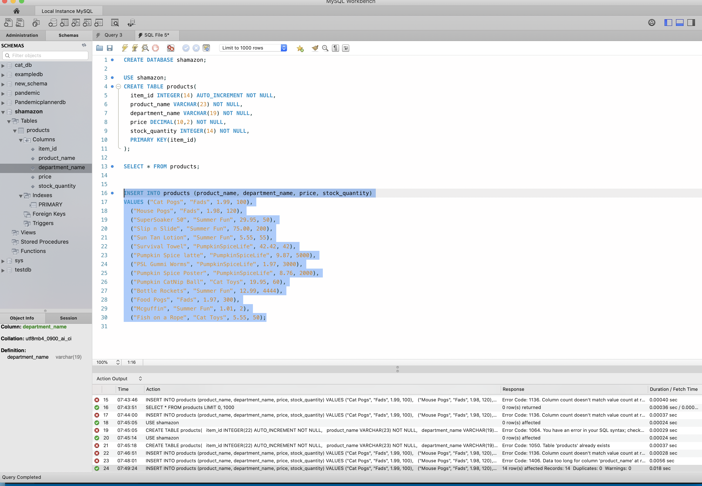
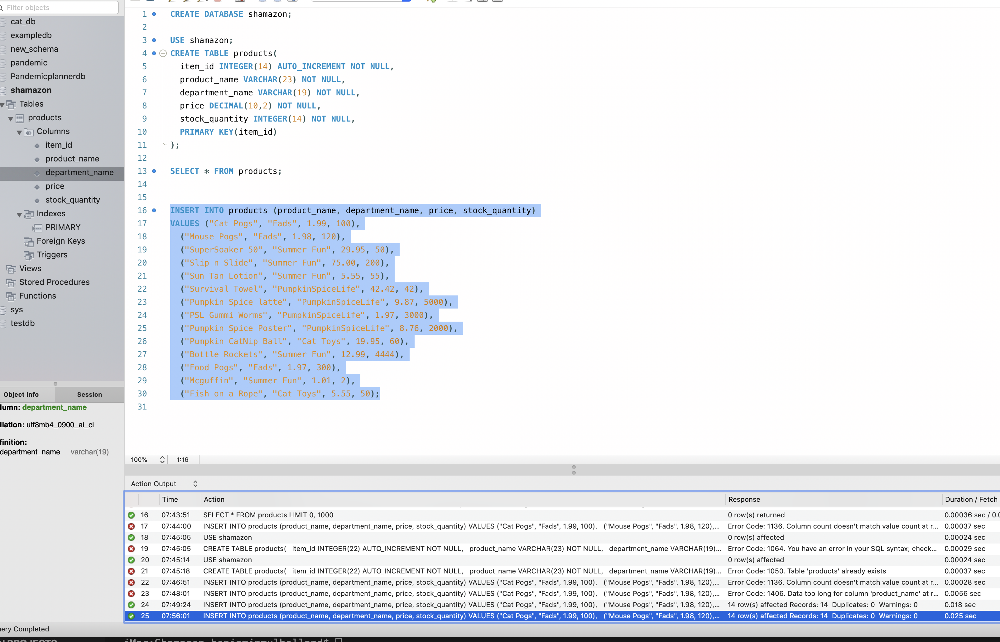

# Shamazon
an amazon-like storefront Command Line Interface program using MySQL and npm Inquirer

_____
## steps to start:
* cd shamazon or cd into the directory that contains the shamazon.js file
* npm install or npm i
* node shamazon.js

* User is prompted to select an id number 15-28
  User should type one of those integers followed by return/enter key
* User then types amount/quantity of item they want to purchase
* Returns success message. the storefront is shown again the stock_quantity will reflect the remaining inventory
* User can type capital Q at any time to leave the store.
* If user chooses to purchase a sold out item 'insufficient quantity is displayed and the store reloads again.
_____
# Demo

_____
### Future plans for Shamazon 
is to build a manager function, and to learn how to not create identical items in database. 

After testing for insufficient quantity, and instead of dropping entire database, the demo above shows the resulting sql update which shows the products twice, from previous test.

